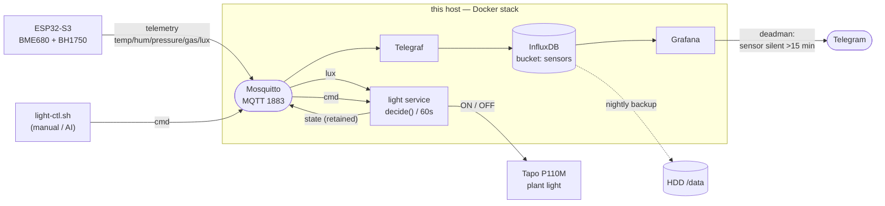

# monitor-air server stack

The server side of `monitor-air`, run via Docker Compose:



| Service    | Role                                   | Address                         |
|------------|----------------------------------------|---------------------------------|
| mosquitto  | MQTT broker (devices publish here)     | `<host>:1883`                   |
| influxdb   | time-series storage (bucket `sensors`) | `127.0.0.1:8086` (localhost)    |
| telegraf   | MQTT → InfluxDB bridge (no code)       | internal                        |
| grafana    | charts / dashboards                    | `http://<host>:3001`            |
| light      | plant-light controller (lux → P110M)   | internal                        |
| sim        | synthetic publisher (optional)         | internal, `--profile sim`       |

> **Note:** Grafana is mapped to host port **3001** (host `3000` was already
> taken on this machine). Change the `grafana` port mapping in
> `docker-compose.yml` if you want a different one.

## First-time setup

```bash
# 1. backup target on the HDD (owned by uid 1000 so the influx container can write)
mkdir -p /data/influx-backups          # use sudo + chown 1000:1000 if not already yours

# 2. secrets
cd broker
cp .env.example .env
#    edit .env — set passwords and a strong token:
#      DOCKER_INFLUXDB_INIT_ADMIN_TOKEN=$(openssl rand -hex 32)

# 3. bring up the stack
docker compose up -d
docker compose ps                       # influxdb should be "healthy"
```

InfluxDB's `DOCKER_INFLUXDB_INIT_*` vars are **only applied on the very first
start** (empty `influxdb-data` volume). To change org/bucket/token afterwards
you must `docker compose down -v` (this wipes the DB).

## Run / operate

| Action               | Command                                       |
|----------------------|-----------------------------------------------|
| Status               | `docker compose ps`                           |
| Logs                 | `docker compose logs -f telegraf` (etc.)      |
| Stop (keep data)     | `docker compose down`                         |
| Stop + wipe all data | `docker compose down -v`                      |

## Synthetic data (for testing without the ESP32)

```bash
docker compose --profile sim up -d sim      # start fake publisher
docker compose logs -f sim                  # watch it publish
docker compose stop sim                      # stop it
```

The sim publishes to `monitor-air/sim/telemetry`. Its points carry the tag
`device=sim`, so you can delete them later:

```bash
docker compose exec -T influxdb influx delete --bucket sensors \
  --org monitor-air --token "$DOCKER_INFLUXDB_INIT_ADMIN_TOKEN" \
  --start 1970-01-01T00:00:00Z --stop 2100-01-01T00:00:00Z \
  --predicate 'device="sim"'
```

## Data contract (the firmware must follow this)

- **Topic:** `monitor-air/<device>/telemetry` (e.g. `monitor-air/sensor-01/telemetry`)
- **Payload (JSON, all values floats):**
  ```json
  {"temp":24.8,"hum":51.2,"pressure":1009.3,"gas":12.4,"lux":350.0}
  ```
  Keep every field a float (`lux:350.0`, not `350`) — InfluxDB fixes a field's
  type on first write, and int/float drift causes partial write failures.

Telegraf maps this to measurement `air`, tag `device` (2nd topic segment), and
one float field per key.

## Plant-light control

The `light` service reads `lux` from telemetry and switches a **Tapo P110M**
plug (the plant light). The ESP32 knows nothing about the plug — it only
reports lux. Decisions run here on a 60 s tick.

**Rule (v1):** only turn on within a local-time window when it's dark, with a
lux hysteresis gap to stop flapping, and a hard off in the evening. A
dead/stale sensor fails safe to OFF. All knobs (`LUX_ON_BELOW`, `ON_START`,
`HARD_OFF`, `MIN_HOLD`, …) live at the top of `control/light.py`.

**Topics** (`<loc>` = `LIGHT_LOCATION`):

| Topic | Payload | Notes |
|-------|---------|-------|
| `monitor-air/<loc>/light/cmd` | `{"state":"ON"\|"OFF"}` | **external override seam** — publish here to drive the plug manually / from an AI agent (holds off auto for `MANUAL_HOLD`). Not retained. |
| `monitor-air/<loc>/light/state` | `{"state":"ON","on":1,"source":"auto"}` | retained; `on` is charted in Grafana (measurement `light`). |
| `monitor-air/<loc>/light/availability` | `online`/`offline` | retained + MQTT LWT. |

**Config** (`.env`, see `.env.example`): `TAPO_EMAIL`, `TAPO_PASSWORD`,
`TAPO_IP`, `LIGHT_LOCATION`, `LIGHT_SENSOR_DEVICE`, `LIGHT_TZ`, `MQTT_HOST`.

```bash
docker compose up -d --build light            # start it
docker compose run --rm light python /light.py --selftest   # check decide() logic
# manual switch (via the MQTT command seam — pauses auto control ~2h):
./light-ctl.sh on        # or: off | status
```

## Viewing charts

Open `http://<host>:3001`, log in (`admin` / your `GF_SECURITY_ADMIN_PASSWORD`),
open the **monitor-air** dashboard. A **sensor-freshness** table on top, then
time-series panels (temp / humidity / pressure / gas / light) and a **DLI** bar
chart. The InfluxDB datasource is auto-provisioned (uid `influxdb-monitor-air`).

The **DLI** panel estimates the Daily Light Integral (mol/m²/day) over the last
7 local days by integrating `PPFD ≈ lux / 54` per day. This is a daylight-spectrum
approximation, **not** a true PAR measurement — an AS7341 spectral sensor would
give real PAR; lux dropouts undercount, and today's bar is partial.

## Monitoring / device health

The top table shows **seconds since each `device × field` last reported** — one
row per device, one column per sensor field, populated automatically by grouping
on the `device` tag and `_field` (no per-device config). Green < 3 min, red > 5
min (aligned with the controller's `STALE`). A single red cell with green
neighbours means **that sensor dropped** (e.g. the BH1750 lux field cutting out
while the BME680 keeps reporting); a **whole red row** means the device is
offline. This catches per-field dropouts that the time-series panels hide.

> **Keep the firmware contract:** on a sensor read failure, **omit** that field
> from the JSON rather than sending `0`/a fake value — omission is what makes a
> dropout detectable here.

### Deadman alert (Telegram)

A provisioned Grafana alert rule (`provisioning/alerting/rules.yaml`, folder
**Device health**) fires per `(device, field)` when that series has been silent
for **>15 min** — one rule covers all current and future devices/fields
automatically. 15 min sits above the BH1750's transient gaps, so it pages only
on a genuine sustained outage; the 5-min table is the fine-grained view.

Telegram delivery is configured via Grafana's API (not file provisioning, which
mis-types a numeric chat id). One-time setup:

```bash
# 1. create a bot with @BotFather → bot token; get your numeric chat id by
#    messaging the bot then GET https://api.telegram.org/bot<token>/getUpdates
# 2. put both in broker/.env:
#      TELEGRAM_BOT_TOKEN=...
#      TELEGRAM_CHAT_ID=...
# 3. wire up the contact point + route (idempotent; re-run after a token change):
bash grafana/setup-telegram.sh
# 4. test delivery:
curl -s "https://api.telegram.org/bot$TELEGRAM_BOT_TOKEN/sendMessage" \
  -d chat_id=$TELEGRAM_CHAT_ID -d text=monitor-air-test
```

The rule is declarative (in git); the contact point + route live in Grafana's DB
(created by the script, so the bot token never enters version control).

## Backups (to the HDD)

Live data sits on the SSD (named volume `influxdb-data`); backups go to the HDD
at `/data/influx-backups`.

```bash
bash broker/backup/influx-backup.sh        # one-off backup + rotation (keeps newest 14)
```

Schedule a daily backup via cron (`crontab -e`):

```cron
30 3 * * * "$HOME"/monitor-air/broker/backup/influx-backup.sh >> "$HOME"/monitor-air/broker/backup/backup.log 2>&1
```

The script resolves its own path, loads `broker/.env`, and is safe under cron's
minimal environment. Tune retention with `KEEP=30 bash .../influx-backup.sh`.

## Storage rationale

InfluxDB does many small random writes (WAL + compactions) → it belongs on the
**SSD**. A year of this single sensor compresses to well under a few hundred MB,
so the HDD's capacity isn't needed for the live DB. The **HDD** is used for
periodic backups (bulk sequential writes, off the primary disk).

## Security note

Mosquitto is anonymous-open and Grafana/InfluxDB use the passwords in `.env` —
fine for an isolated LAN. Before exposing anything beyond the LAN, add MQTT
auth (see below), put Grafana behind TLS, and rotate the InfluxDB token.

### Locking down MQTT later

The broker mounts `config` read-only, so generate the password file on the host:

```bash
docker run --rm -it -v "$PWD/config:/c" eclipse-mosquitto:2 \
  mosquitto_passwd -c /c/passwd <username>
```

Then set in `config/mosquitto.conf`:

```conf
allow_anonymous false
password_file /mosquitto/config/passwd
```

and `docker compose restart mosquitto`.
